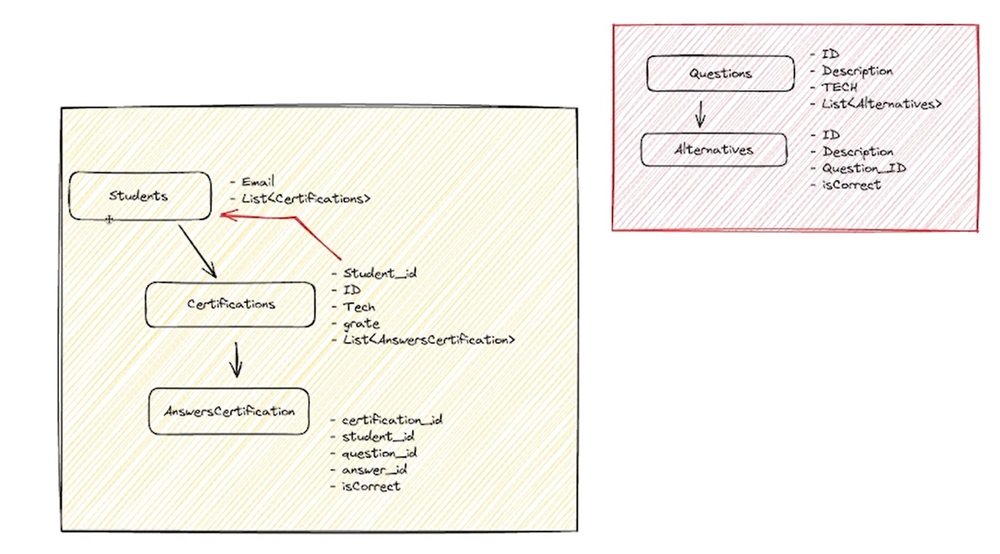

# nlw-expert-java

## Construindo o Projeto 🧱

Neste projeto, estamos construindo uma aplicação utilizando Java e Spring. Essa API vai simular uma funcionalidade onde os usuários podem fazer testes de certificação. Eles inserem seu email, escolhem o tema do teste e respondem às perguntas. No final, eles recebem suas notas e podemos gerar um ranking dos 10 melhores alunos.
 
A aplicacao foi desenvolvida em Java 17 utilizando o framework Spring Boot 3.2.2 e banco de dados PostgreSQL.  

 

## Ferramentas utilizadas 🛠

- IntelliJ IDEA
- Postman
- Spring
- Docker
- PostgreSQL

 

## API REST (Métodos mais comuns)

- GET: Buscar dados;
- PUT: Atualizar/Alterar dados;
- POST: Inserir dados;
- DELETE: Deletar dados;
- PATCH: Alterar pontualmente um dado.

 

## End Points

Para acessar os endPoints da aplicação, [clique aqui](./postman/postman-collection.json) e faça o download do arquivo. 
Utilize a ferramenta de gerenciamento de API´s da sua preferencia. Para este projeto, utilizei o Postman.

 

## ⚙️ Executando a aplicação

- Executar o comando docker-compose up -d
- Executar a aplicacao
- Na primeira execucao e (sempre que apagar as tabelas 'questions' e 'alternatives'): com a aplicacao em execucao, executar a classe CreateSeed. Isso vai fazer com que as tabelas de alternativas e questoes sejam criadas e carregadas com os dados contidos no arquivo create.sql
